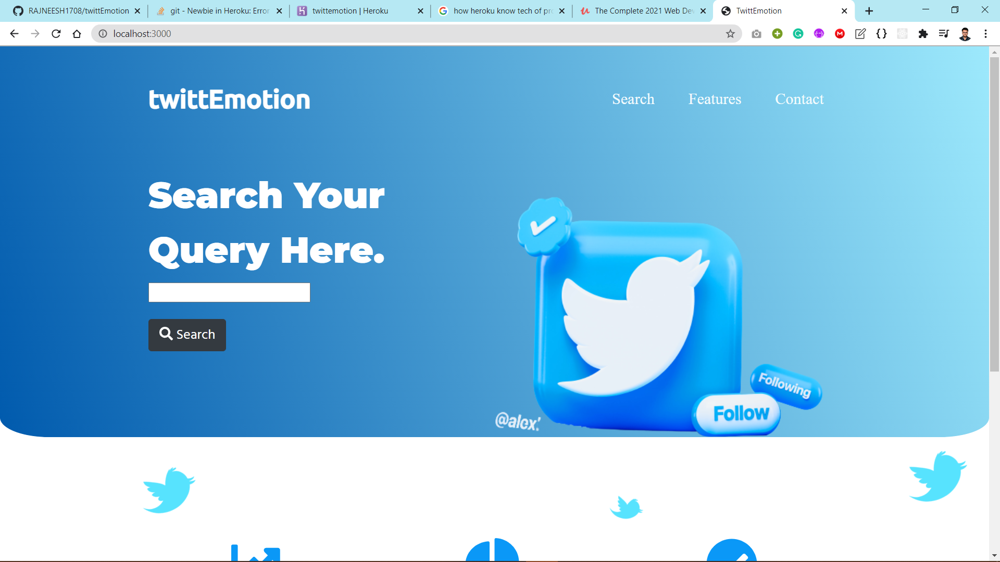
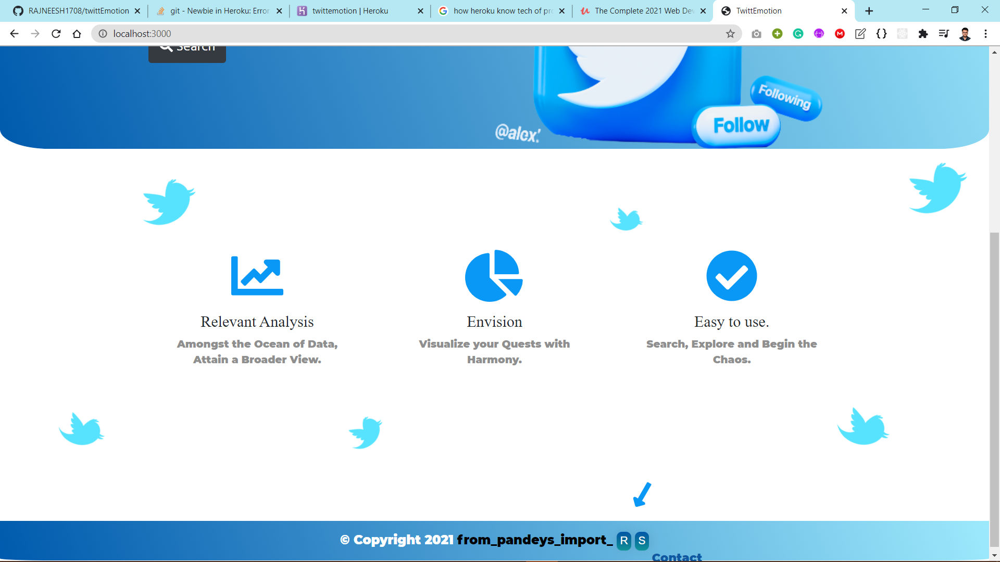
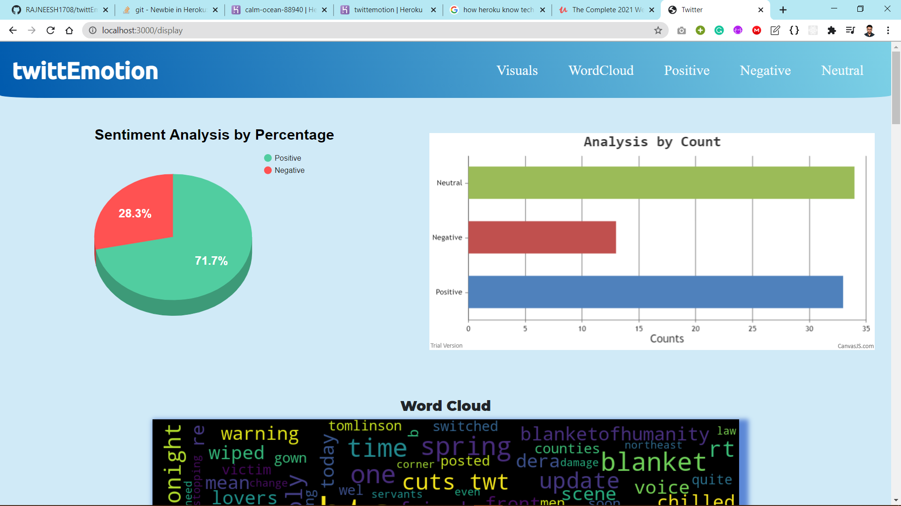
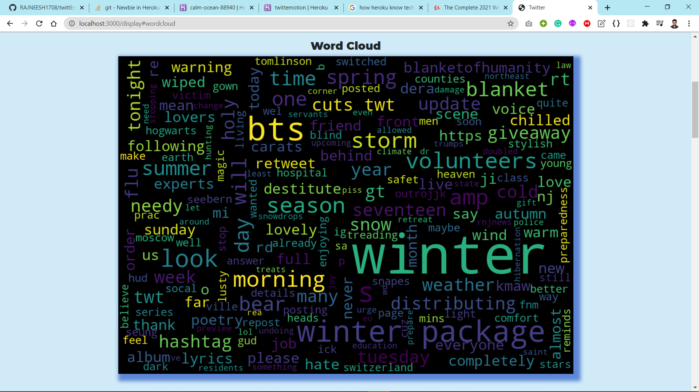
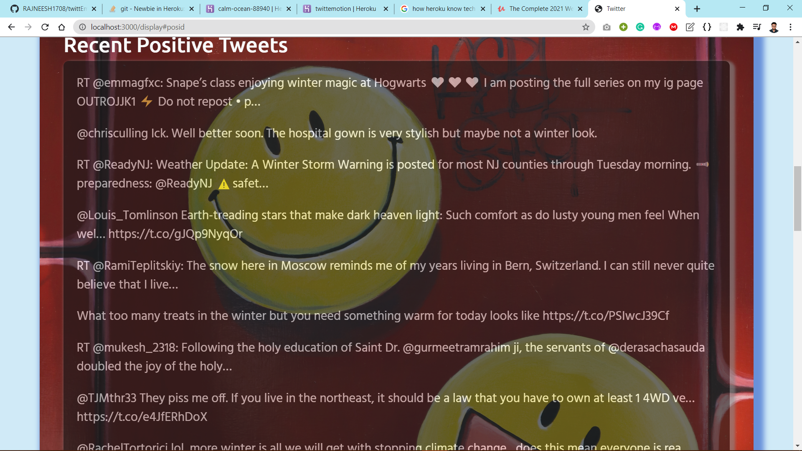
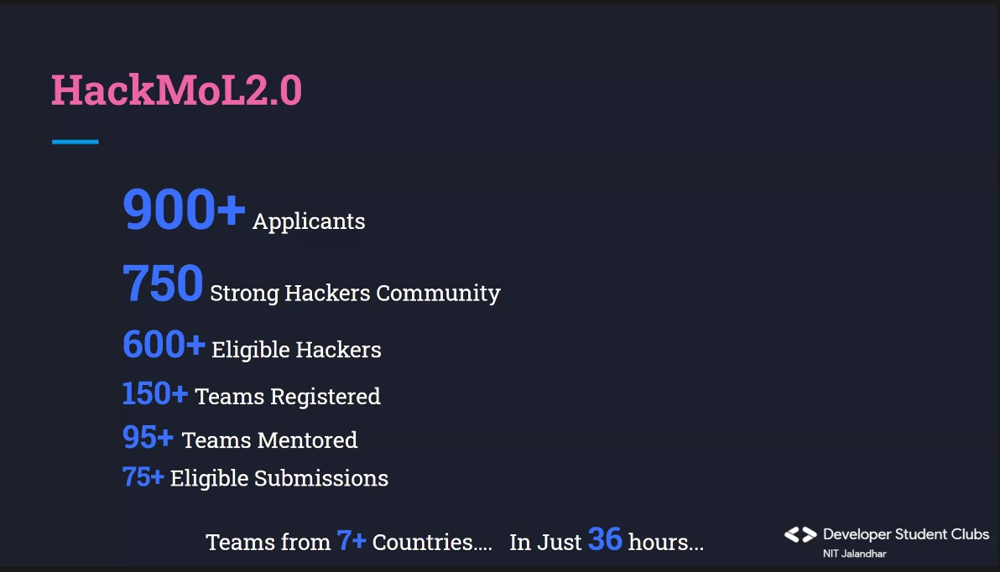

<h1>twittEmotion</h1></a>

<h4><em>Latest Tweets Analysis customized for Query (Hashtags, Username etc.) searched by User.</em></h4>
<h4><=<a href="https://twittemotion.herokuapp.com/"> Website Link</a>=></h4>

<h3>The Purpose :</h3>

  While the User can visit the Internet and get lost in the huge number of
  different Opinions Available, The Model gives an Overview of the Situation
  in terms of Clear Stats and Visual Analysis corresponding to Tweets
  fetched from Live Recent Data broadly regarding Positive, Negative or
  Generic Statements for the Query Provided by User.

<h2>Some Glimpses:</h2>

   

    

<h2>In Short :</h2>
<ul>
<li> We provide a User Friendly Beautiful UI.</li>
<li> It is Super Easy to Use and Gives User the Freedom for any Query.</li>
<li> Visual Analysis is Provided regarding the Live Data Fetched.</li>
<li> The Common Ideas talked about are shown as a WordCloud.</li>
<li> Recent Positive, Negative and Neutral Tweets are also Displayed.</li></ul>

<h4>Note: To Run in Development mode, Use your own Twitter API Keys.</h4>

<h4>This Project was made for HackMol 2.0 Hackathon.👇🏼</h4>

Our Team <strong><em>from_pandeys_import_RS</em></strong> got <strong>6th</strong> Position.

